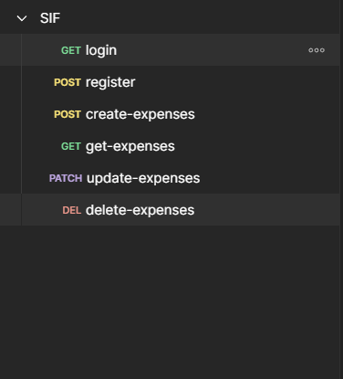

# Expense Tracker - Backend

## Getting started

Expense Tracker api service..

- Postman collection is added in the repository

#### Install required tools

- [Node.js](https://nodejs.org) (v18.x.x)
- [MongoDB](https://www.mongodb.com/)

Core package used in the project

- [express](https://www.npmjs.com/package/express)
- [nodemon](https://www.npmjs.com/package/nodemon)
- [mongoose](https://www.npmjs.com/package/mongoose)
- [dotenv](https://www.npmjs.com/package/dotenv)
- [cors](https://www.npmjs.com/package/cors)
- [jsonwebtoken](https://www.npmjs.com/package/jsonwebtoken)
- [bcrypt](https://www.npmjs.com/package/bcrypt)

#### Clone the repo

```bash
git clone https://github.com/ChRakesh27/Expense-Tracker.git
```

### Install dependencies

```bash
npm install
```

#### Run local server

Run start will start the server with nodemon in development mode. server start on `http://localhost:3001`

```bash
npm run start
```

or

```bash
npm run start:dev
```

## Postman collection

- postman collection available - [collection link](./postman%20collection/Rakesh%20-%20Task-Manager.postman_collection.json)

  
